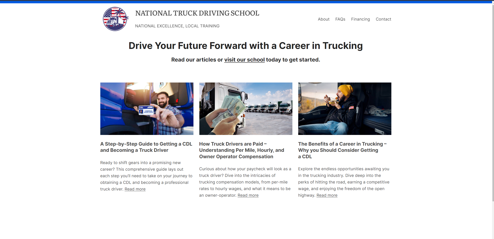
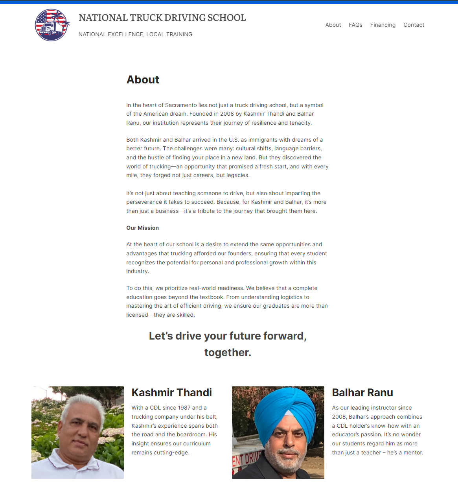
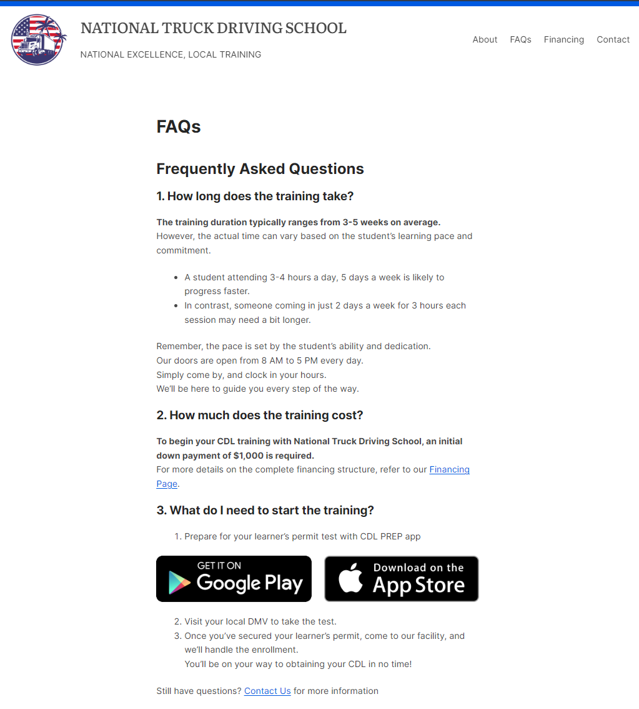
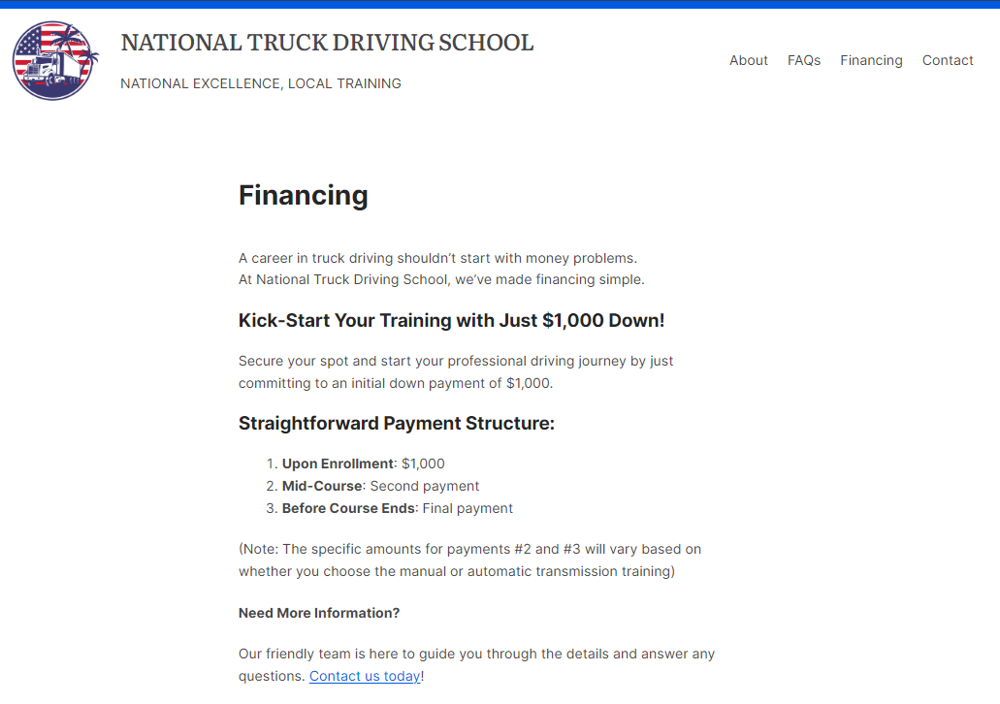
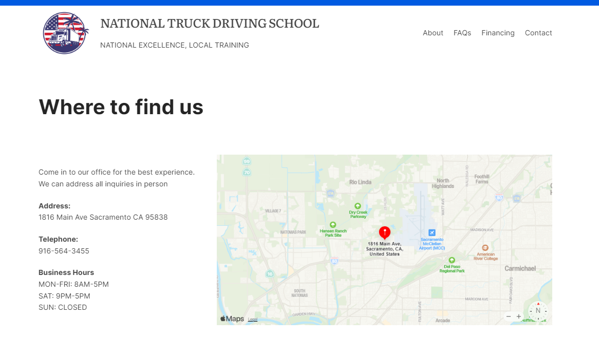

# National Truck Driving School Website

## About
The National Truck Driving School website serves as an online hub to provide comprehensive information for potential truck driving students. \
Designed to streamline communication and facilitate easy access to resources. 

## Features
### Homepage / Educational Articles: 
Insightful content to educate visitors on the trucking profession, including a step-by-step guide to obtaining a CDL and the benefits of a trucking career. \

### School History: 
Information on the school's legacy and its founders, underlining our long-standing commitment to quality education in truck driving. \
 

### Study Resources and FAQ: 
Links to study apps available on the App Store and Google Play Store to help new students get their permit and kickstart the process. \
 

### Financing Information: 
Clear guidance on financial options to help students in making informed decisions regarding their CDL journey. \
 

### Contact and Directions: 
Easy access to contact information and directions to our campus, ensuring that potential students can find us without hassle. \
 

## Built With
### WordPress: 
The website is powered by WordPress.
### Elementor: 
I used Elementor to design the website. It matches the NATIONAL aesthetic and provides clear instruction for those who may be technologically challeged
